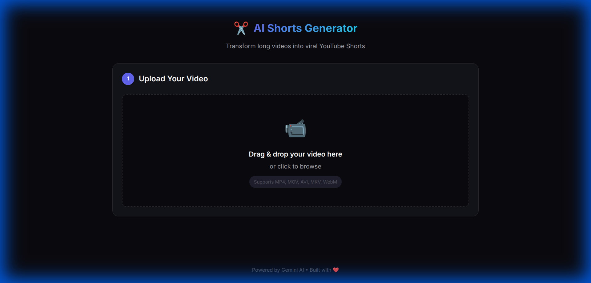

# YouTube Shorts Generator

Generate viral YouTube Shorts from longer videos using AI-powered analysis, smart context optimization, and automatic clipping.



## Features

- 🖥️ **Modern Frontend** - Drag & drop interface with dark mode and real-time progress
- 🎙️ **Audio-First Processing** - Fast analysis by extracting audio before upload (reduces size by ~95%)
- 🧠 **Smart Context Optimization** - AI detects sentence breaks to ensure clips don't start mid-thought
- 🔍 **Viral Segment Analysis** - Identifies hooks, emotional peaks, and shareable moments
- ✂️ **Precision Clipping** - FFmpeg-based cutting with accurate timestamps
- ⚡ **High Performance** - Powered by Gemini 3 Flash for speed and accuracy

## Requirements

- Python 3.11+
- FFmpeg (must be installed on system)
- Google Gemini API key

## Quick Start

1. **Install dependencies:**
   ```bash
   uv sync
   ```

2. **Configure environment:**
   ```bash
   cp .env.example .env
   # Add your GEMINI_API_KEY to .env
   ```

3. **Run the application:**
   ```bash
   uv run uvicorn app.main:app --reload
   ```

4. **Open the frontend:**
   Navigate to `http://localhost:8000` in your browser.

## Workflow

1. **Upload Video**: Drag and drop your video file (supports large files).
2. **Identify Shorts**: The AI analyzes the audio to find viral segments.
3. **Context Check**: A second AI pass adjusts start times to finding natural sentence breaks.
4. **Generate & Download**: Review the identified shorts and generate MP4 clips instantly.

## API Endpoints

| Method | Endpoint | Description |
|--------|----------|-------------|
| POST | `/api/v1/videos/upload` | Upload a video file |
| POST | `/api/v1/shorts/identify/{video_id}` | Identify potential shorts |
| POST | `/api/v1/shorts/generate/{video_id}` | Generate short clips |
| GET | `/api/v1/shorts/{short_id}` | Download a generated short |

## Configuration

| Variable | Description | Default |
|----------|-------------|---------|
| `GEMINI_API_KEY` | Google Gemini API key | Required |
| `GEMINI_MODEL` | Gemini model to use | `gemini-3-flash-preview` |
| `VIDEO_FPS` | FPS for timestamp precision | `5` |
| `MIN_SHORT_DURATION` | Min duration (seconds) | `15` |
| `MAX_SHORT_DURATION` | Max duration (seconds) | `90` |

## License

MIT
